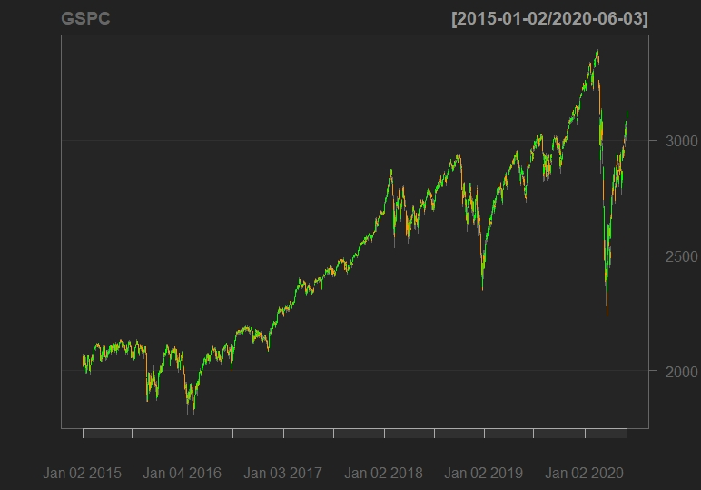
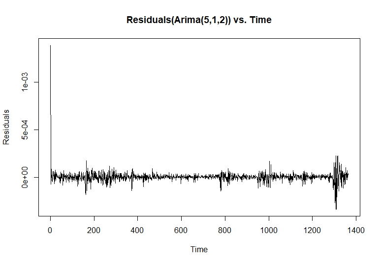
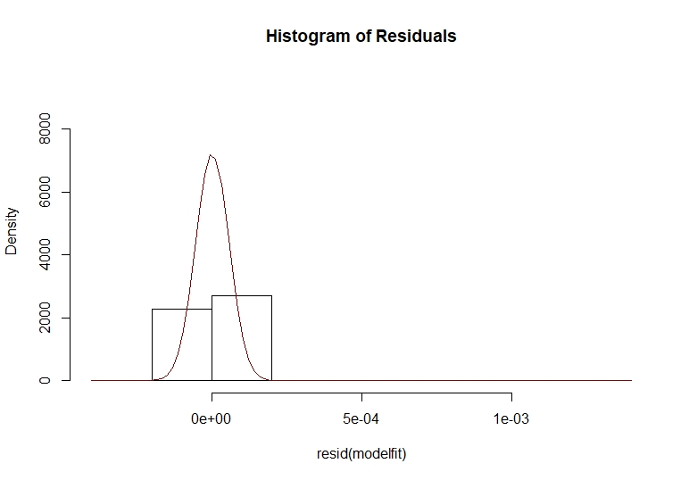
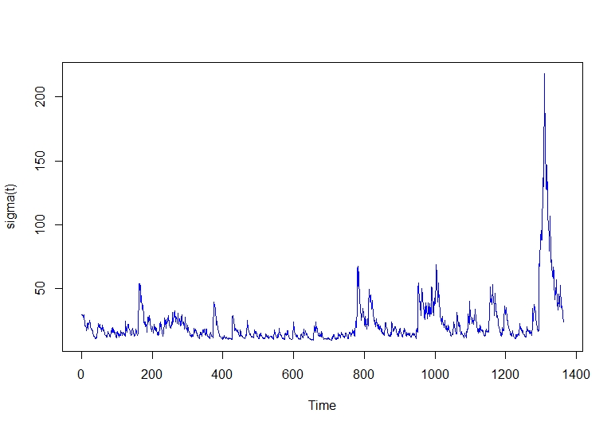
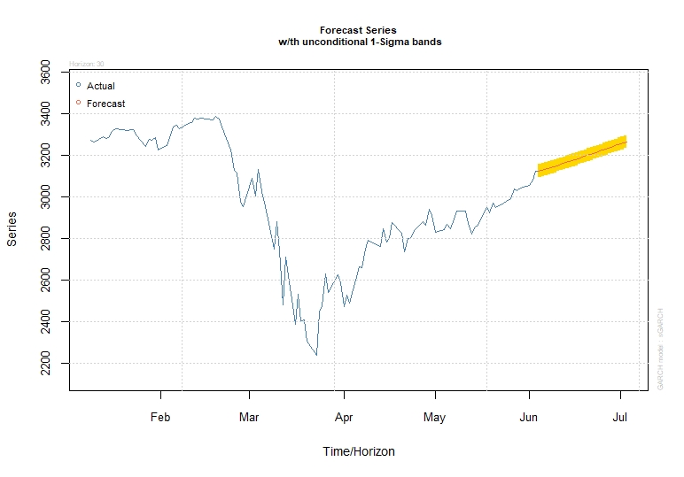
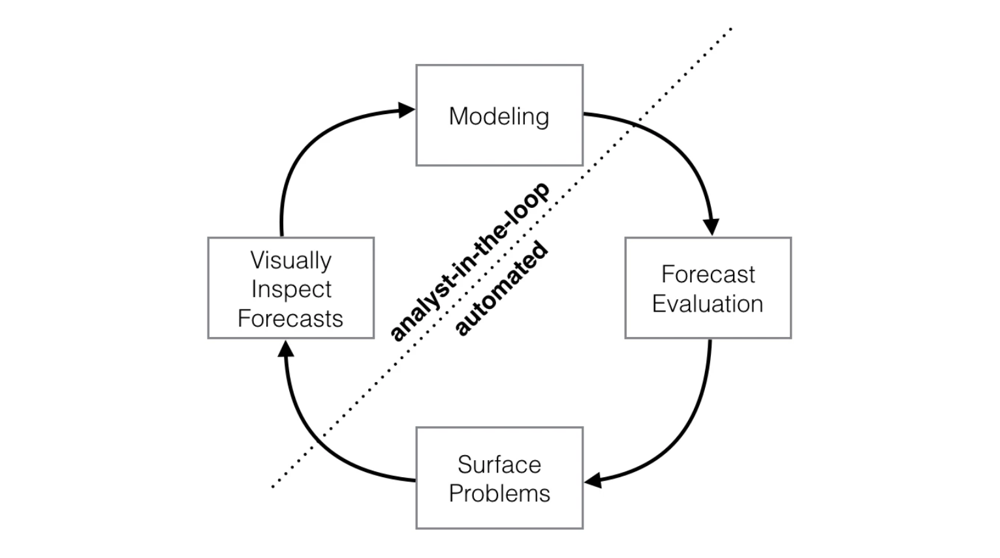
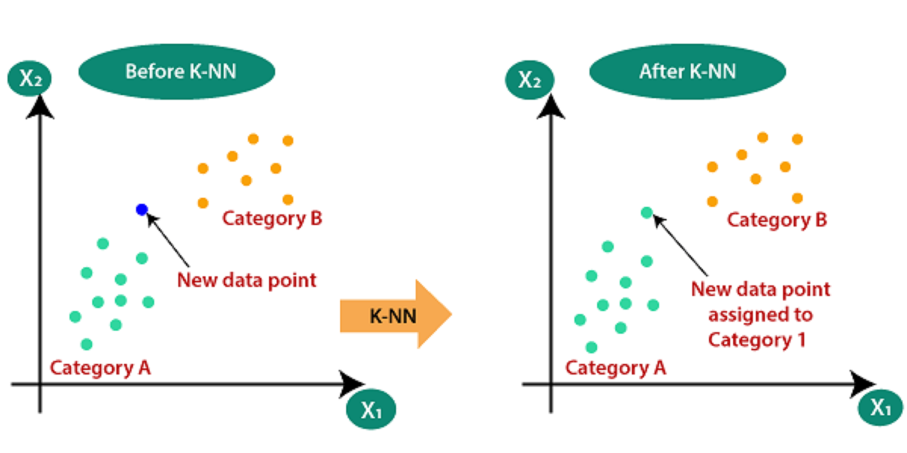
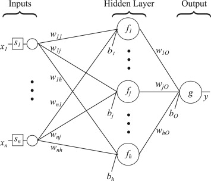
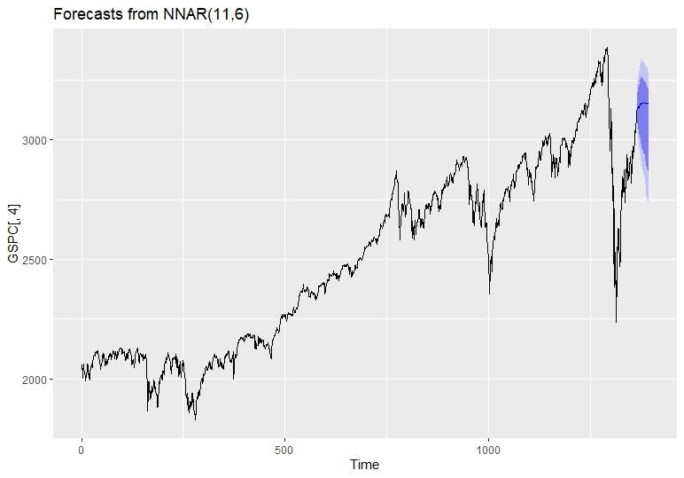

# Forcasting of a Time Series (Stock Market) Data in R
### *A Comparative Study by,* 

#### _Shreyashi Saha_ _and_ _Sagarnil Bose_
###### _Students of Masters in Statistics_


### Contents

####  **Overview**  
  
####  **Introduction**  
  
####  **Dataset and Advanced Visualizations**  
  
####  **Methods**
 * *ARIMA*: &nbsp; *Autoregressive Integrating Moving Average Model
		   -Forecasting
		   -Arima Results*
 * *GARCH*: &nbsp; *Generalized Autoregressive Conditional Heteroscedastic Model
		   -Garch Forecasting
                   -Garch Results*
 * *Prophet-Prophet Forecasting-Prophet Results*
 * *K-NN regression time series forecasting*
 * *Feed Foward Neural network*  
 
  ####  **Conclusion**  
 
  ####  **Reference**

### **Overview**
This project describes different time series and machine learning forecasting models applied to a real stock close price dataset. For this project we will start with a general idea of the stock price, including dataset analysis. Followed by a general description and analysis of the dataset, our objective is to apply different forecasting predictive models for “S&P500” stock daily close price. The models will be evaluated, analyzed and compared, following the main course project directions. The data will be prepared to predict the next 30 days’ close price from today. The results will be explained during the report along with concluding remarks.
### **Introduction**
A forecasting algorithm is an information process that seeks to predict future values based on past and present data. This historical data points are extracted and prepared trying to predict future values for a selected variable of the dataset. In this project approach we will focus on quantitative forecasting involving our variable to forecast (close price), its statistical analysis and advanced concepts applied to a given historical data.

Historically, there has been a continuous interest in trying to analyze market tendencies, behavior and random reactions. This continuous concern to understand what happens before it really happens motivates us to continue with this study. Some great market traders and economists says that is almost impossible to predict stock returns or prices referring to, independence between each other, the past movements or trends cannot be used to predict future values, explained by random walk theory, skewness, kurtosis and big random component. With the new different advanced models, we will try to go against the current, because, why not? As this is a data science project this forecasting models are not considered as oracles, but are really useful for analyzing the movements of stock prices with a statistical approach. The main objective of this research is to show the models fitted, compare them and encourage the use of them.

Let us firstly load the following libraries into the R environment
```{r}
#libraries
library(quantmod)
library(ggplot2)
library(forecast)
library(tseries)
library(rugarch)
library(prophet)
library(tsfknn)
```
If the libraries are not installed, install the required packages with `install.packages("library.name")`
### **Dataset and Advanced Visualizations**
Firstly, we take a glimpse into the data.
```{r}
getSymbols("^GSPC",src="yahoo",from="2015-01-01",to = "2020-06-04")
head(GSPC)
```
```
# Index        GSPC.Open   GSPC.High   GSPC.Low   GSPC.Close   GSPC.Volume   GSPC.Adjusted
# 2015-01-02   2058.90     2072.36     2046.04    2058.20      2708700000    2058.20
# 2015-01-05   2054.44     2054.44     2017.34    2020.58      3799120000    2020.58
# 2015-01-06   2022.15     2030.25     1992.44    2002.61      4460110000    2002.61
# 2015-01-07   2005.55     2029.61     2005.55    2025.90      3805480000    2025.90
# 2015-01-08   2030.61     2064.08     2030.61    2062.14      3934010000    2062.14
# 2015-01-09   2063.45     2064.43     2038.33    2044.81      3364140000    2044.81
```
Now, we try to visualize the close price data with the following graph
```{r}
chartSeries(GSPC,TA = NULL)
```



For a more advanced view, we add Bollinger Band chart, % Bollinger change, Volume Traded and Moving Average Convergence Divergence to the above graph.


For a more detailed code [visit here.](https://github.com/Stat-Wizards/Forcasting-a-Time-Series-Stock-Market-Data)

Now, for analysing the above Moving Average Convergence Divergence graph we would require a little knowlegde of the Trading Vocabularies and some empirical methods of understanding the close price data. So what is MACD ?

##### **Moving Average Convergence Divergence (MACD)**:
Moving Average Convergence Divergence (MACD) is a trend-following momentum indicator that shows the relationship between two moving averages of a security’s price. The MACD is calculated by subtracting the 26-period Exponential Moving Average (EMA) from the 12-period EMA.

##### **Formula**: 
MACD=12-Period EMA − 26-Period EMA

##### Now, We do understand your fraustration with us, explaining a jargon with another but please do bear with us for just a moment. &nbsp; **So what is EMA ?**

An exponential moving average (EMA) is a type of moving average (MA) that places a greater weight and significance on the most recent data points. The exponential moving average is also referred to as the exponentially weighted moving average. An exponentially weighted moving average reacts more significantly to recent price changes than a simple moving average (SMA), which applies an equal weight to all observations in the period.

The result of that calculation is the MACD line. A nine-day EMA of the MACD called the "signal line," is then plotted on top of the MACD line, which can function as a trigger for buy and sell signals. Traders may buy the security when the MACD crosses above its signal line and sell - or short - the security when the MACD crosses below the signal line. Moving Average Convergence Divergence (MACD) indicators can be interpreted in several ways, but the more common methods are crossovers, divergences, and rapid rises/falls.

##### So why do you need to know about MACD ?
* Moving Average Convergence Divergence (MACD) is calculated by subtracting the 26-period exponential moving average (EMA) from the 12-period EMA.
* MACD triggers technical signals when it crosses above (to buy) or below (to sell) its signal line.
* The speed of crossovers is also taken as a signal of a market is overbought or oversold.
* Traders use the MACD to identify when bullish (↑) or bearish (↓) momentum is high in order to identify entry and exit points for trades.
* MACD is used by technical traders in stocks, bonds, commodities and FX markets 

##### Learning from MACD :
The MACD has a positive value whenever the 12-period EMA (blue) is above the 26-period EMA (red) and a negative value when the 12-period EMA is below the 26-period EMA. The more distant the MACD is above or below its baseline indicates that the distance between the two EMAs is growing. MACD is often displayed with a histogram (see the chart below) which graphs the distance between the MACD and its signal line. If the MACD is above the signal line, the histogram will be above the MACD’s baseline. If the MACD is below its signal line, the histogram will be below the MACD’s baseline. Traders use the MACD’s histogram to identify when bullish or bearish momentum is high.

##### Limitations :
One of the main problems with divergence is that it can often signal a possible reversal but then no actual reversal actually happens – it produces a false positive. The other problem is that divergence doesn't forecast all reversals. In other words, it predicts too many reversals that don't occur and not enough real price reversals.

##### Now, enough of technical trading and empirical understanding of the data. Lets do some Statistricks already.
##### Obviously, we start with a Classical one, Machine Learning can wait okay?

### **Methods**

##### Arima : Autoregressive Integrating Moving Average

ARIMA stands for Autoregressive Integrated Moving Average. ARIMA is also known as Box-Jenkins approach. Box and Jenkins claimed that non-stationary data can be made stationary by differencing the series, Y<sub>t</sub>. The general model for Y<sub>t</sub> is written as,


Or,  

Where, Y<sub>t</sub> is the differenced time series value, ϕ and θ are unknown parameters and e are independent identically distributed error terms with zero mean. Here, Y<sub>t</sub> is expressed in terms of its past values and the current and past values of error terms.

The ARIMA model combines three basic methods:

* **Auto Regression (AR)**: In auto-regression the values of a given time series data are regressed on their own lagged values, which is indicated by the “p” value in the model.
* **Differencing (I for Integrated)**: This involves differencing the time series data to remove the trend and convert a non-stationary time series to a stationary one. This is indicated by the “d” value in the model. If d = 1, it looks at the difference between two time-series entries, if d = 2 it looks at the differences of the differences obtained at d =1, and so forth.
* **Moving Average (MA)**: The MA nature of the model is represented by q values which is the number of lagged values of the error term.

This model is called Autoregressive Integrated Moving Average or ARIMA (p, d, q) of Yt.  We will follow the steps enumerated below to build our model.

**Step 1: Testing and Ensuring Stationarity**

To model a time series with the Box-Jenkins approach, the series has to be stationary. A stationary time series means a time series without trend, one having a constant mean and variance over time, which makes it easy for predicting values.

Testing for stationarity – We test for stationarity using the Augmented Dickey-Fuller unit root test. The p-value resulting from the ADF test has to be less than 0.05 or 5% for a time series to be stationary. If the p-value is greater than 0.05 or 5%, you conclude that the time series has a unit root which means that it is a non-stationary process.

Differencing – To convert a non-stationary process to a stationary process, we apply the differencing method. Differencing a time series means finding the differences between consecutive values of a time series data. The differenced values form a new time series dataset which can be tested to uncover new correlations or other interesting statistical properties.

We can apply the differencing method consecutively more than once, giving rise to the “first differences”, “second order differences”, etc.
We apply the appropriate differencing order (d) to make a time series stationary before we can proceed to the next step.

**Step 2: Identification of p and q**

In this step, we identify the appropriate order of Autoregressive (AR) and Moving average (MA) processes by using the Autocorrelation function (ACF) and Partial Autocorrelation function (PACF).

Identifying the p order of AR model
For AR models, the ACF will dampen exponentially and the PACF will be used to identify the order (p) of the AR model. If we have one significant spike at lag 1 on the PACF, then we have an AR model of the order 1, i.e. AR (1). If we have significant spikes at lag 1, 2, and 3 on the PACF, then we have an AR model of the order 3, i.e. AR (3).

Identifying the q order of MA model
For MA models, the PACF will dampen exponentially and the ACF plot will be used to identify the order of the MA process. If we have one significant spike at lag 1 on the ACF, then we have an MA model of the order 1, i.e. MA (1). If we have significant spikes at lag 1, 2, and 3 on the ACF, then we have an MA model of the order 3, i.e. MA (3).

**Step 3: Estimation and Forecasting**

Once we have determined the parameters (p, d, q) we estimate the accuracy of the ARIMA model on a training data set and then use the fitted model to forecast the values of the test data set using a forecasting function. In the end, we cross check whether our forecasted values are in line with the actual values.

First we conduct an ADF test for the close price set:
```{r}
## ADF Test
print(adf.test(GSPC$GSPC.Close))
```
```{r}
# Augmented Dickey-Fuller Test
#  data:  GSPC$GSPC.Close
#  Dickey-Fuller = -4.2322, Lag order = 11, p-value = 0.01
#  alternative hypothesis: stationary
```

After the ADF test we apply ACF (Autocorrelation function) and PACF (Partial autocorrelation function) functions to the dataset.
```{r}
## Plot ACF and PACF

par(mfrow = c(1, 2))
acf(GSPC$GSPC.Close)
pacf(GSPC$GSPC.Close)
par(mfrow = c(1, 1))

#dev.off()
```


Autocorrelation refers to how correlated a time series is with is past values. As we know in AR models the ACF will dampen exponentially. The ACF is the plot used to see the correlation between the points, up to and including the lag units. We can see that the autocorrelation is significant for large number of lags, but perhaps the autocorrelation at posterior lags are merely due to propagation of autocorrelation at the first lags.

We use ACF and PACF plot to identify the (q) order and the PACF will dampen exponentially. If we can note that it is a significant spike only at first lags, means that all the higher order autocorrelation is effectively explained by the first lag autocorrelation.

Now, we fit our model to the price data.
```{r}
## Applying auto.arima() to the dataset 
modelfit <-auto.arima(GSPC$GSPC.Close, lambda = "auto")
summary(modelfit)
```

We can see our model factors now.

```{r}
# Series: GSPC$GSPC.Close 

# ARIMA(5,1,2) 

# Box Cox transformation: lambda= -0.7182431 

# Coefficients:

#           ar1      ar2     ar3     ar4     ar5     ma1     ma2
#       -1.6503  -0.8038  0.0364  0.0502  0.0434  1.5262  0.6656

# s.e.   0.0863   0.0944  0.0569  0.0545  0.0362  0.0825  0.0692

# sigma^2 estimated as 3.071e-09:  log likelihood=11849.61

# AIC=-23683.23   AICc=-23683.12   BIC=-23641.49

# Training set error measures:

#                    ME     RMSE      MAE        MPE      MAPE     MASE        ACF1
# Training set 1.211636 31.65724 17.56103 0.04474109 0.7083487 1.016037 -0.02548426
```
With our model summary we can check the residuals of the model with ARIMA parameters selected

```{r}
# Diagnostics on Residuals
plot(resid(modelfit),ylab="Residuals",main="Residuals(Arima(5,1,2)) vs. Time")
```


The “residuals” in a time series model are what is left over after fitting a model. In majority of time series models, the residuals are equal to the difference between the observations and the fitted values:

 &nbsp; &nbsp; &nbsp; 
 
 As we did some correlation tests to our dataset, we now check our residuals over a normal curve.
 ```{r}
# Histogram of Residuals & Normality Assumption
hist(resid(modelfit),freq=F,ylim=c(0,9500),main="Histogram of Residuals")
e=resid(modelfit)
curve(dnorm(x, mean=mean(e), sd=sd(e)), add=TRUE, col="darkred")
 ```


As we can see, the residuals plot has a descent normal curve adjustment, giving us a good point to continue this study. Now we can make our last residuals plot, giving us the standardized residuals, ACF of residuals and p-values for Ljung-Box statistic plots.

```{r}
# Diagnostics tests for Arima
tsdiag(modelfit)
```


With this 3 graphs we focus on the Ljung-Box p-values. For the Ljung-Box test we have that our null hypothesis is:

H<sub>θ</sub>: The dataset points are independently distributed.

With this null hypothesis, a significant p-value greater than 0.05 does not rejects the fact that the dataset points are not correlated.

In the previous p-values Ljung-Box plot, we can see that in lag 1 we have a smaller p-value. Given this visual inspection we proceed to analyze this lag with an independent test.
```{r}
# Box test for lag=2
Box.test(modelfit$residuals, lag= 2, type="Ljung-Box")
```
```{r}
# Box-Ljung test
# data:  modelfit$residuals
# X-squared = 1.1885, df = 2, p-value = 0.552
```
As we can see our p-value still not rejects our null hypothesis, allowing us to make a generalized box test.

```{r}
Box.test(modelfit$residuals, type="Ljung-Box")
```
```{r}
# Box-Ljung test
# data:  modelfit$residuals
# X-squared = 0.76978, df = 1, p-value = 0.3803
```
In this generalized test we can see that our null hypothesis is still not rejected, allowing us to continue our study with a solid motivation.

Having our new ARIMA model applied and analyzed we can plot the model prediction in a red line over the real train set stock close price.

```{r}
plot(as.ts(GSPC$GSPC.Close))
lines(modelfit$fitted,col="red")
```


**Arima Results**  

Now with the model fitted we can proceed to forecast our daily close price values to the future. We focus on forecasting the close stock price for the next 30 days or an average month.  

We can now plot our forecast for the next 30 days.

```{r}
plot(forecast(modelfit,h=30))
```


As we can see, we have a blue line that represents the mean of our prediction.

```{r}
price_forecast <- forecast(modelfit,h=30)
plot(price_forecast)
head(price_forecast$mean)
```
```{r}
# Time Series:
#  Start = 1365 
#  End = 1370 
#  Frequency = 1 
#  [1] 3113.484 3120.944 3119.524 3118.773 3122.801 3116.676
```

With the blue line explained we can see a darker and light darker areas, representing 80% and 95% confidence intervals respectively in lower and upper scenarios.

Our lower scenario:
```{r}
# Time Series:
# Start = 1365 
# End = 1370 
# Frequency = 1 
#           80%      95%
# 1365 3043.480 3007.509
# 1366 3028.100 2980.854
# 1367 3006.451 2949.411
# 1368 2987.954 2922.467
# 1369 2977.728 2905.546
# 1370 2956.716 2877.652
```
Our Upper scenario:
```{r}
# Time Series:
# Start = 1365 
# End = 1370 
# Frequency = 1 
#           80%      95%
# 1365 3186.300 3226.041
# 1366 3218.789 3272.741
# 1367 3240.106 3307.223
# 1368 3259.752 3338.883
# 1369 3280.459 3369.550
# 1370 3292.106 3391.974
```
To get the code of the above two results [visit here.](https://github.com/Stat-Wizards/Forcasting-a-Time-Series-Stock-Market-Data)

Finalizing our ARIMA model we do a quick test and train set approach dividing the close price data. We select our train set as the 70 percent of our dataset. The test set y the 30 remaining percent of the dataset.
```{r}
# Dividing the data into train & test sets , Applying the model
N = length (GSPC$GSPC.Close)
n = 0.8*N
train = GSPC$GSPC.Close[1:n, ]
test = GSPC$GSPC.Close[(n+1):N,]
trainarimafit <- auto.arima(train$GSPC.Close ,lambda= "auto")
summary(trainarimafit)
predlen= length(test)
trainarima_fit <- forecast(trainarimafit, h= predlen)
```
Once we have our prediction applied over the train set we plot the mean tendency of our forecasting over the test set close price move.

```{r}
#Plotting mean predicted  values vs real data
meanvalues<- as.vector(trainarima_fit$mean)
precios <- as.vector(test$GSPC.Close)
plot(meanvalues, type = "l",col="red")
lines(precios, type = "l")
#dev.off()
```


In the red line we see our mean forecasting prediction tendency over the real close price of the stock. The tendency shows a good approach predicting the future direction of the close price.

##### Garch : Generalized Autoregressive Conditional Heteroscedasticity
###### Introduction

The previous presented ARIMA model has very good results, but not as satisfying as we expected. This results biases are main explained by the volatile observations of our dataset and financial market series. This situation is a cause of concern when it comes to predicting new values. **The Generalized Autoregressive Conditional Heteroscedasticity model** have a foundation on making "Volatility clustering”. This clustering of volatility is based on there are periods with relative calm movements and periods of high volatility. This behaviour is **very typical** in the **financial stock market** data as we said and GARCH model is a very good approach to minimize the volatility effect. From evaluating GARCH models implementation we will take the normal residuals and then square them. By doing this residual plots, any volatile values will visually appear. We try to apply a standard GARCH (1, 1) model over ARMA (5,2), looking if we have improved our accuracy and model parameters.

###### Autoregressive Conditional Heteroscedasticity
The **Autoregressive Conditional Heteroscedasticity (ARCH)** model is a statistical model for time series data that describes the variance of the current error term or innovation as a function of the actual sizes of the previous time periods' error terms often the variance is related to the squares of the previous innovations. The ARCH model is appropriate when the error variance in a time series follows an autoregressive (AR) model; if an autoregressive moving average (ARMA) model is assumed for the error variance, the model is a **Generalized Autoregressive Conditional Heteroscedasticity** (GARCH) model.  

To model a time series using an ARCH process, let e<sub>t</sub> denote the error terms (return residuals, with respect to a mean process), i.e. the series terms. These e<sub>t</sub> are split into a stochastic piece z<sub>t</sub> and a time-dependent standard deviation σ<sub>t</sub> characterizing the typical size of the terms so that, 

 &nbsp; &nbsp; &nbsp; 
 
 The random variable z<sub>t</sub> is a strong white noise process. The series σ<sub>t</sub>^2 is modelled by,
 
&nbsp; &nbsp; &nbsp; 

If an ARMA model is assumed for the error variance, the model is a generalized autoregressive conditional heteroscedasticity (GARCH) model.
In that case, the GARCH (p, q) model (where p is the order of the GARCH terms σ^2 and q is the order of the ARCH terms e^2) , following the notation of the original paper, is given by

&nbsp; &nbsp; &nbsp;   
&nbsp; &nbsp; &nbsp;   
&nbsp; &nbsp; &nbsp;   

Generally, when testing for heteroscedasticity in econometric models, the best test is the White test. However, when dealing with time series data, this means to test for ARCH and GARCH errors.

##### Autoregressive Fractionally Integrated Moving Average  

Autoregressive fractionally integrated moving average models are time series models that generalize ARIMA (autoregressive integrated moving average) models by allowing non-integer values of the differencing parameter. These models are useful in modeling time series with long memory—that is, in which deviations from the long-run mean decay more slowly than an exponential decay. The acronyms ARFIMA or FARIMA are often used, although it is also conventional to simply extend the ARIMA (p,d,q) notation for models, by simply allowing the order of differencing, d, to take fractional values. An ARFIMA model shares the same form of representation as the ARIMA (p, d, q) process, specifically,

&nbsp; &nbsp; &nbsp;   

In contrast to the ordinary ARIMA process, the "difference parameter", d, is allowed to take non-integer values.

We proceed to apply the model previously defined to the close price dataset for finding ARFIMA(autoregressive fractionally integrated moving average) parameters.
```{r}
# Fitting Afrima
fitarfima = autoarfima(data = GSPC$GSPC.Close, ar.max = 5, 
                       ma.max = 2,criterion = "AIC", method = "full")
fitarfima$fit
```
```{r}

*----------------------------------*
*          ARFIMA Model Fit        *
*----------------------------------*
Mean Model	: ARFIMA(5,0,2)
Distribution	: norm 

Optimal Parameters
Estimate   Std.Error  t value Pr(>|t|)
mu    2015.42371    4.438054 454.1233 0.000000
ar1     -0.69994    0.053413 -13.1044 0.000000
ar2      0.97147    0.039540  24.5692 0.000000
ar3      0.91525    0.063107  14.5031 0.000000
ar4     -0.12205    0.035448  -3.4431 0.000575
ar5     -0.09518    0.039793  -2.3919 0.016763
ma1      1.62233    0.043906  36.9498 0.000000
ma2      0.72284    0.034990  20.6587 0.000000
sigma   28.69536    0.577512  49.6879 0.000000

Robust Standard Errors:
Estimate   Std.Error   t value Pr(>|t|)
mu    2015.42371    5.845048 344.80877 0.000000
ar1     -0.69994    0.150931  -4.63750 0.000004
ar2      0.97147    0.057737  16.82585 0.000000
ar3      0.91525    0.185642   4.93021 0.000001
ar4     -0.12205    0.050323  -2.42537 0.015293
ar5     -0.09518    0.104593  -0.91001 0.362818
ma1      1.62233    0.079718  20.35094 0.000000
ma2      0.72284    0.034451  20.98181 0.000000
sigma   28.69536    4.091210   7.01391 0.000000

Log Likelihood: -6514.02

Information Criteria
Akaike       9.5645
Bayes        9.5990
Shibata      9.5645
Hannan-Quinn 9.5774

Weighted Ljung-Box Test on Standardized Residuals
statistic  p-value
Lag [1]                              2.583 1.08e-01
Lag[2*(p+q)+(p+q)-1][20]    38.217 0.00e+00
Lag[4*(p+q)+(p+q)-1][34]    55.897 2.22e-16

H0: No serial correlation

Weighted Ljung-Box Test on Standardized Squared Residuals
statistic p-value
Lag[1]                      354.3       0
Lag[2*(p+q)+(p+q)-1][2]     530.5       0
Lag[4*(p+q)+(p+q)-1][5]     921.4       0


ARCH LM Tests
Statistic DoF P-Value
ARCH Lag[2]      466.6   2       0
ARCH Lag[5]      509.7   5       0
ARCH Lag[10]     562.5  10       0

Nyblom stability test

Joint Statistic:  11.832
Individual Statistics:             
mu    0.09505
ar1   2.08097
ar2   2.15325
ar3   1.50304
ar4   2.67606
ar5   2.26071
ma1   0.02611
ma2   0.08301
sigma 7.01724

Asymptotic Critical Values (10% 5% 1%)
Joint Statistic:     	 2.1 2.32 2.82
Individual Statistic:	 0.35 0.47 0.75
```

With the parameters collected we choose ARFIMA (3,0,2) and incorporate the parameters to a GARCH model.

```{r}
# Define the model
garch11closeprice=ugarchspec(variance.model=list(garchOrder=c(1,1)),
                             mean.model=list(armaOrder=c(3,2)))
# Estimate model 
garch11closepricefit=ugarchfit(spec=garch11closeprice, data=GSPC$GSPC.Close)
```
Having our model fitted, we can make a volatility plot.
```{r}
# Conditional volatility plot
plot.ts(sigma(garch11closepricefit), ylab="sigma(t)", col="blue")
```


As we can see, the last years of our data have higher peaks, explained by the economic instability in markets this last years. We can see our Akaike and other information of our model.
```{r}
# Model akike
infocriteria(garch11closepricefit)
```
```{r}
# Model Akaike
# Akaike       8.768009
# Bayes        8.802440
# Shibata      8.767923
# Hannan-Quinn 8.780897
```


```{r}
# Normal residuals
garchres <- data.frame(residuals(garch11closepricefit))
plot(garchres$residuals.garch11closepricefit)
```


Now we proceed to calculate and plot the standardized residuals.
```{r}
# Standardized residuals
garchres <- data.frame(residuals(garch11closepricefit, standardize=TRUE))
#Normal Q plot
qqnorm(garchres$residuals.garch11closepricefit,standardize=TRUE)
qqline(garchres$residuals.garch11closepricefit,standardize=TRUE)
```


We see that we have some extreme values that are out of the normal distribution, but the majority of the data points are centred in the line. Having the normality plot of our standardized residuals we make a Ljung Box test to the squared standardized residuals.
```{r}
#Squared standardized residuals Ljung Box
garchres <- data.frame(residuals(garch11closepricefit, standardize=TRUE)^2)
Box.test(garchres$residuals.garch11closepricefit..standardize...TRUE..2, type="Ljung-Box")
```
```{r}
# Squared Standardised Residual Ljung Box
# Box-Ljung test
# X-squared = 1.289, df = 1, p-value = 0.2562
```
With Ljung Box test we can see that our standardized squared residuals do not reject the null hypothesis, confirming that we are not having autocorrelation between them. As we found our volatility and residuals behaviour we can proceed forecasting our next 30 days and compare to the other models.

###### GARCH Forecasting  

With the model fitted and the values forecasted we plot our data prediction.



As we are using GARCH for correcting our ARIMA predictions we will not deeply evaluate this model.  

To get the code of the above graph [visit here.](https://github.com/Stat-Wizards/Forcasting-a-Time-Series-Stock-Market-Data)  

### **Prophet**

The origin of prophet comes from the application of a forecasting model into supply chain management, sales and economics. This model helps with a statistical approach in shaping business decisions. The Prophet model has been developed by Facebook’s Core Data Science team and it is an open-source tool for business forecasting.




The Prophet model is an additive model with the components g(t) models trends, s(t) models seasonality with Fourier series, h(t) effects of holidays or large events. For this study we are not going to deeply analyze the Prophet model operations because they are too dense and deep that it requires a new independent study but we did some amount of explaining.

##### Prophet Forecasting
```{r}
#Prophet Forecasting
#Loading time series forecasting prophet package
##Dataframe creation and model application
df <- data.frame(ds = index(GSPC),
                 y = as.numeric(GSPC[,4]))
prophet_pred = prophet(df)
future = make_future_dataframe(prophet_pred,periods=30)
fcastprophet = predict(prophet_pred,future)
```
```{r}
#Creating train prediction dataset to compare real data
dataprediction = data.frame(fcastprophet$ds,fcastprophet$yhat)
trainlen = length(GSPC$GSPC.Close)
dataprediction = dataprediction[c(1:trainlen),]
```


To get the code of the above graph [visit here.](https://github.com/Stat-Wizards/Forcasting-a-Time-Series-Stock-Market-Data)  

With the model applied and the forecast plotted we proceed to calculate the model performance. As we are new into this model application we will use the accuracy function to compare the real values against the estimated values of the train set. The correct approach for doing this in Prophet is to create a cross-validation process and analyse the model performance metrics, but we are trying to compare the ARIMA vs the other models with the same approach.

Once we have created our dataset to compare the real data against the predicted values, we proceed to calculate the accuracy.

```{r}
#Creating Cross Validation
accuracy(dataprediction$fcastprophet.yhat,df$y)

```
```{r}
#                  ME     RMSE      MAE        MPE    MAPE
# Test set 0.01260116 96.05275 64.88581 -0.1404824 2.58817
```
Finally for a better understanding of the dataset we can plot our prophet components divided by a trend component, weekly seasonality and yearly seasonality.
```{r}
prophet_plot_components(prophet_pred,fcastprophet)
```


### **KNN Regression for Time-Series Forecasting**

  


KNN model can be used for both classification and regression problems. The most popular application is to use it for classification problems. Now, the KNN can also be implemented on any regression task. The idea of this study is illustrating the different forecasting tools, comparing them and analysing the behaviour of predictions. Following our KNN study, we proposed it can be used for both classification and regression problems. For predicting values of new data points, the model uses ‘feature similarity’, assigning a new point to a values based on how close it resembles the points on the training set.Our main objective is trying to forecast new values of our stock price using a KNN experimental approach.  

For this prediction we will use a k equals to 50 as an experimental value because we did a heuristic approach trying to find the best k value. KNN algorithms require tuning experiments but as this study is to show the different forecasting tools we will aim deeply on the application than the tuning of the model for getting the best accuracy.


```{r}
#Dataframe creation and model application
df <- data.frame(ds = index(GSPC),
                 y = as.numeric(GSPC[,4]))

predknn <- knn_forecasting(df$y, h = 30, lags = 1:30, k = 50, msas = "MIMO")

```  


```{r}
#Train set model accuracy
ro <- rolling_origin(predknn)
print(ro$global_accu)
```  


```{r}  
#  RMSE      MAE     MAPE
#  153.8021 131.9580   4.7621
```  

 

Using the rolling origin function, we use the model and the time series associated to assess the forecasting accuracy of the model.
Once we have studied our model we can plot our predictions in the following graph.


  
  ```{r}  
  autoplot(predknn)

  ```
 


  

Having this new KNN predictions graph we can now proceed to compare it with the other models. Before comparing the predictions, we will focus on our 4th model and last approach applied to forecasting with neural networks.

  
 ###  **Feed-Forward Neural Networks**  
  
  A single hidden layer neural network is the simplest neural networks form. In this single hidden layer form there is only one layer of input nodes that send weighted inputs to a subsequent layer of receiving nodes. We fit a single hidden layer neural network model to a time series. The function model approach is to use lagged values of the time series as input data, reaching to a non-linear autoregressive model.  
  
  
  
  
 
 For this approach we will select the specific number of hidden nodes is half of the number of input nodes (including external regressors, if given) plus 1.We use a Box Cox lambda to ensure the residuals will be roughly homoscedastic. We forecast the next 30 values with the neural net fitted.We proceed to apply the nnetarfunction with the parameterlambda selected.  
 
 
 ```{r}  
 #Fitting nnetar
lambda = BoxCox.lambda(GSPC$GSPC.Close)
dnn_fit = nnetar(GSPC[,4],lambda=lambda)
dnn_fit
 ```  
 Below is model summary of the Feed Forward Neural Networks Model.

```{r}  
#  Series: GSPC[, 4] 

#  Model:  NNAR(11,6) 

#  Call:   nnetar(y = GSPC[, 4], lambda = lambda)

#  Average of 20 networks, each of which is
#  a 11-6-1 network with 79 weights
#  options were - linear output units 

#  sigma^2 estimated as 1.187e-09

```  

 
```{r}  
 fcast = forecast(dnn_fit,PI=T,h=30)
autoplot(fcast)
 ```
 
  

```{r}  
accuracy(dnn_fit)  
```  

```{r}  

#   ME        RMSE     MAE       MPE         MAPE       MASE       ACF1
#   0.2082332 22.74244 15.29405 -0.001138679 0.6109943  0.8848755  0.03257684
```  

###  **Conclusion**
In this study we focused in the application of different models, learning how to use them with the objective to forecast new price values. As we can see from our results, the models performed with similar future tendency predictions. All the models predicted a tendency of a higher price in 30 next days. We can conclude that the ARIMA and Neural Net models performed very well inside the prediction intervals and the accuracy metrics. The other models as they are new in this forecasting approach and the objective is to apply them in an intuitive form did not performed as well as ARIMA or Neural Net models. Maybe Prophet and KNN needs more tuning for getting more accurate results. Other very relevant point we have not mentioned is that Auto Regressive models, as they base on the past data to predict future values, tend to have an asymptotic prediction in long period future forecasts. Finally, we conclude that ARIMA and Neural Nets are the best predicting models in this scenario, while incorporating GARCH to our ARIMA approach we had very interesting results. The other models used did not performed as well as ARIMA and Neural Nets under our metrics but this could be because they may need more tuning phases and training, testing approaches or they are not as effective as the other models because of their main application use in classificatory terms more than forecasting.
  
  
###  **Reference** 

These were invaluable resources for this project.

A. Trapletti and K. Hornik (2016). tseries: Time Series Analysis and Computational Finance. R package version 0.10-35.

R. J. Hyndman(2016). forecast: Forecasting functions for time series and linear models . R package version 7.2, http://github.com/robjhyndman/forecast.

Irizzary,R., 2018,Introduction to Data Science,github page, https://rafalab.github.io/dsbook/

Sean J Taylor and Benjamin Letham., 2017, Forecasting at scale, https://facebook.github.io/prophet/

Alexios Ghalanos(2019). Rugarch: Univariate GARCH Models. R package version 1.4-1, http://github.com/robjhyndman/forecast.
 
  
